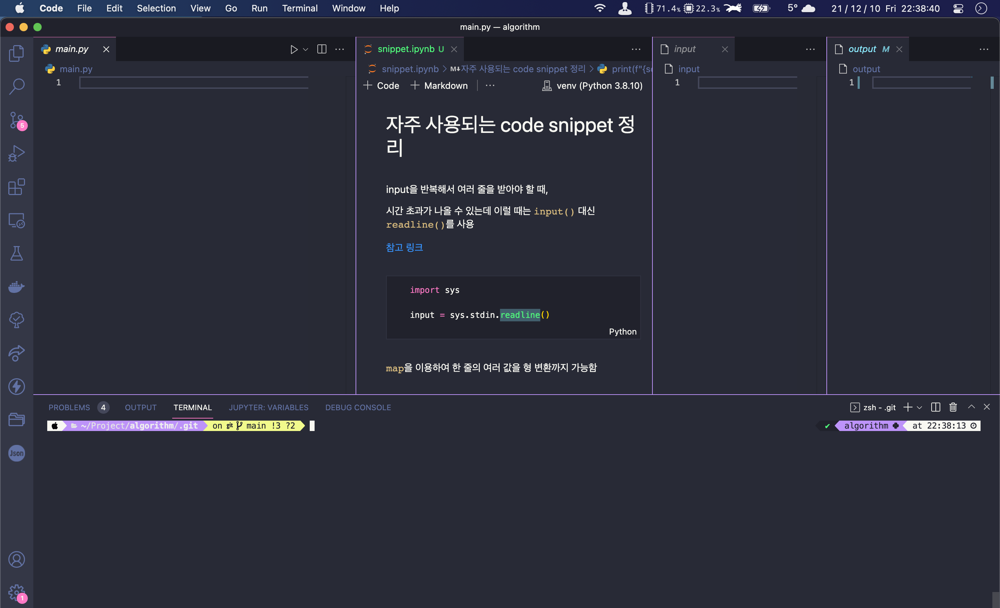

# Algorithm Solve Tool

알고리즘 풀이를 편하게 하기 위한 툴입니다.
python3에 대해서만 작동합니다.
자주 사용되는 snippet은 주피터 노트북에 정리해뒀습니다.

## How to use

1. 쉘 스크립트 실행을 위한 권한 부여<br>
   ```$chmod +x ./check.sh ./debug.sh```
2. input 파일에 예제 input 복사
3. output 파일에 예제 output 복사 **([마지막 줄에 줄바꿈을 넣어주어야 합니다!](https://stackoverflow.com/questions/16222530/why-do-i-need-vim-in-binary-mode-for-noeol-to-work))**
4. main.py에 함수 작성
5. 결과 확인<br>
   ```$./check.sh``` <br>
   input에 대한 디버깅<br>
   ```$./debug.sh```

VS code에 snippet, main.py, input, output을 4개 column으로 열어두고 작업하면 편합니다.


## Contact

castedice1@gmail.com

개선점은 말씀해주시면 반영하겠습니다!